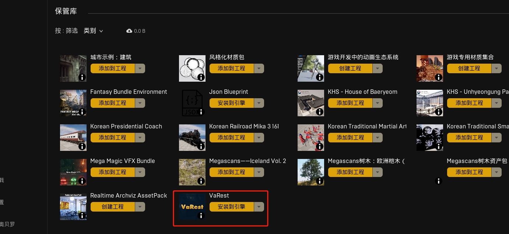
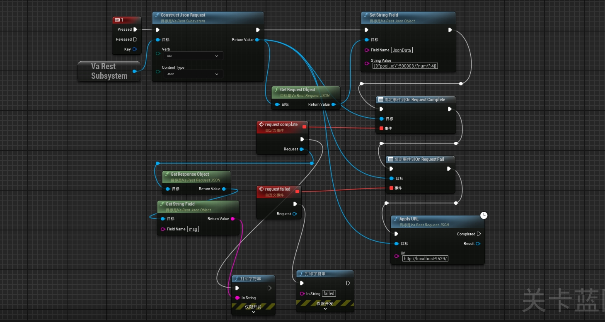

# unreal engine

## 快捷方式

### 快捷键

组合|描述
:-|:-
`alt + 鼠标拖动`|复制
`ctrl + /[0-9]/`|便签
`ctrl + g`|组合
`shift + g`|取消组合
<!--rehype:className=shortcuts show-header-->

### 命名规范
前缀|描述
:-|:-
`alt + 鼠标拖动`|复制
`ctrl + /[0-9]/`|便签
`ctrl + g`|组合
`shift + g`|取消组合
<!--rehype:className=shortcuts show-header-->

## API

### Actor

#### 增

#### 删

- destroy Actor
<!--rehype:className=style-arrow-->

#### 改

#### 查

- Class Of Actor
- Actor has Tag

## 函数、宏（子函数）、自定义事件

### 简要对比
<!--rehype:wrap-class=col-span-3-->

对比项|函数|宏（子函数）|自定义事件
---|---|---|---
执行入口|1个|0-n个|1个
执行出口|1个|0-n个|1个
局部变量|有|无|无
绝技||不需要执行入口,直接像vue中的computed一样当变量用|可以选择只在客户端还是用户端起作用,在多人游戏时很有用
<!--rehype:className=show-header left-align auto-wrap&style=-->

### 自定义事件的绝技

## 通信

### 接口-步骤

发布者需要知道接收方是谁，接口数据是捆绑在接受方上（类似于，接收方需要被发布者精准授权后，才能打开“盒子”看里面装的什么）

### 接口-具体操作
<!--rehype:wrap-class=col-span-2-->

### 事件分发器

发布者不需要知道接收方是谁，接收方自己订阅发布者（类似偶像与粉丝）

## AI 行为树

### 创建用于移动的Actor

- shiashia
- 2 
- 3
- 4
<!--rehype:className=style-timeline-->

### 创建 AI Controller

### 创建行为树

### 创建黑板

## 插件

### 发送http请求
<!--rehype:wrap-class=col-span-3-->

插件名称VaRest，需要在商城中安装一遍，再在UE编辑器-插件中再安装一遍，然后才能使用

<!--rehype:style=width: 50%-->
<!--rehype:style=width: 50%-->
<!--rehype:style=display: flex; gap: 10px;-->

### 像素流送与交互
<!--rehype:wrap-class=col-span-3-->