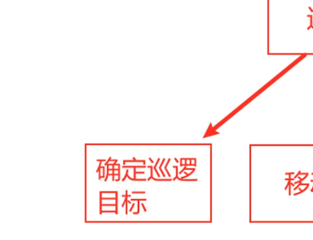

# unreal engine

## API

### Actor

#### 增

#### 删

* destroy Actor

#### 改

#### 查

* Class Of Actor
* Actor has Tag

### http

[虚幻 UE5 发送 get、post 请求、读取 json 文件](https://tinygeeker.blog.csdn.net/article/details/134162447?spm=1001.2101.3001.6661.1&utm_medium=distribute.pc_relevant_t0.none-task-blog-2%7Edefault%7EBlogCommendFromBaidu%7EPaidSort-1-134162447-blog-139749859.235%5Ev43%5Epc_blog_bottom_relevance_base7&depth_1-utm_source=distribute.pc_relevant_t0.none-task-blog-2%7Edefault%7EBlogCommendFromBaidu%7EPaidSort-1-134162447-blog-139749859.235%5Ev43%5Epc_blog_bottom_relevance_base7&utm_relevant_index=1)

## AI 行为树

### 创建用于移动的Actor

-  
helllo

- 2 
- 3
- 4
<!--rehype:className=style-timeline-->

### 创建 AI Controller

### 创建行为树

### 创建黑板
